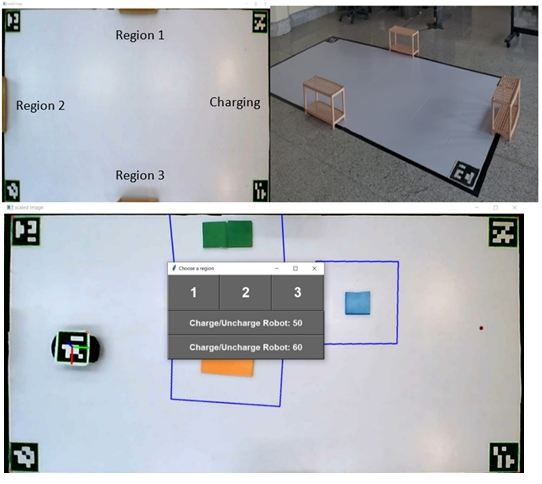

# IndoorLocalization_PathPlanning

This project was developed as a senior design project by Electrical and Computer Engineering students at KAU, Jeddah, KSA in Fall 2021.  

## Introduction
_____  

This software is used to localize and navigate robots indoors using a fixed camera on the roof. The algorithm will guide the robots to avoid fixed obstacles, adapt to the dynamic change of the fixed obstacle’s locations, and will guide them to avoid each other in case they have an intersection of paths. Moreover, this software provides a graphical user interface that shows a live video of the area, and a control panel to direct the robot to the wanted region or to the charging station. Therefore, when asking for a robot in a specific region, the algorithm will choose the nearest available robot and direct it immediately to that region by providing it with the shortest distance path. The figure below will show a demo of the program, where the robot will go from left to the charging station marked with the black point on the right.

## Implementation
_____  

The overall design is a prototyped system consisting of three parts. The first part is the central server, which contains a computer and a virtual router installed on the computer. The second part is a camera fixed on top and can view the warehouse, and it is connected to the central server. The third part is the robots which have an installed microcontroller with a Wi-Fi module to connect them with the central server wirelessly. Accordingly, the central server takes the image data from the camera, analyses it to localize the robots and obstacles, makes path calculations and navigation decisions, and eventually sends them to the robot.

## Code Description
_____  

•	A_Star.py
o	Find the path between two points using A_star algorithm and return the path as points

•	Frames_work.py
o	Identify and return the borders of the station's area.
o	Crop and rescale the frame for showing.
o	Prepare the frame for object detection and A_star algorithm.

•	Mian.py
o	Get the real-time video from the camera.
o	Calibrate the camera.
o	Find ArUco Marker.
o	Initialize the user interface.
o	Initialize the robots.

•	Navigation.py
o	Finding the distance and the angle difference between the robot and the destination point. 

•	ObjectDetector.py
o	detect the object on each frame and return a NumPy array with objects that have been detected

•	Pose_Est.py
o	Finding the position and angle of the ArUcos that install on the robots.
o	Changing position of the Arucos in cm.

•	Robot.py
o	Define the robot as a class with its own attributes and functions.

•	Calibration.py
o	Find camera matrix, new camera matrix, dist vector, and roi vector for calibrate the camera.

## The Team
Abdullah AbdulRahim Qusaier : abdullahqusaier@gmail.com  
Ibrahim Waleed Alfaris: ialfa499@gmail.com   
Osamah Mohammed BaDughaish: osamah.badghaish@gmail.com  

## Acknowledgement
The project was finished with technical and logistics help from Robotics Lab at Center Of Excellence in Intelligent Engineering Systems, KAU.   

## Project in Action  
https://www.youtube.com/watch?v=Zt0aHOAupio
